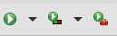

# Corona Trip

## Sumário

- [Corona Trip](#corona-trip)
  - [Sumário](#sumário)
  - [Versão do projeto](#versão-do-projeto)
  - [Sobre o projeto](#sobre-o-projeto)
  - [Casos de Uso do projeto](#casos-de-uso-do-projeto)
  - [Pré-requisitos do projeto](#pré-requisitos-do-projeto)
  - [Ferramentas utilizadas no projeto](#ferramentas-utilizadas-no-projeto)
  - [Como executar o projeto](#como-executar-o-projeto)
    - [Uma vez atendidos os pré-requisito, basta executar seguintes códigos:](#uma-vez-atendidos-os-pré-requisito-basta-executar-seguintes-códigos)
      - [Comando 1](#comando-1)
  - [Observações](#observações)
  - [Autores](#autores)
  - [Conclusão](#conclusão)
  - [Licença](#licença)
  - [Referencias](#referencias)

## Versão do projeto

Versão 1.0

## Sobre o projeto

Este é um projeto para a matéria de programação web com java.

Que tem como tema, melhorar a experiência de quem pretende organizar uma viagem após a pandemia.

PRÉ REQUISITOS PARA O DESENVOLVIMENTOA solução deve contemplar as seguintes tecnologias:

<ul>
  <li> Servlets </li>
  <li> JSTL </li>
  <li> Bootstrap </li>
  <li> HTML </li>
  <li> CSS </li>
  <li> JavaScript </li>
  <li> Banco de dados </li>
  <li> Requisição HTTP </li>
  <li> Arquitetura MVC </li>
</ul>

REGRAS APLICADAS AO DESENVOLVIMENTO - Todos os campos que possuem entrada de dados devem ser validados para não permitir submeter valores nulos para o servidor.-Utilizar apenas um servlet por CRUD-O   sistema   deve   aplicar   o   padrão   MVC,   cada   camada   com   sua responsabilidade especifica -Todos os métodos devem estar devidamente comentado-Criar uma pasta para armazenar os CSS e os arquivos de scripts.

Nosso projeto tem como objetivo, cadastrar determinadas pousadas, e forneçer as informações delas para o usuário, bem como mostrar alguns dados da covid nesso local.

## Casos de Uso do projeto


## Pré-requisitos do projeto

Ter um servidor java WEB.
Ex: Apache Tomcat ou GlassFish.

E o jdk instalado.

## Ferramentas utilizadas no projeto

<ul>
  <li> Eclipse </li>
  <li> Git </li>
  <li> GitHub </li>
  <li> Figma </li>
  <li> WorkBench Mysql</li>
</ul>

## Como executar o projeto

Como utilizei o eclipse no desenvolvimento, rodo o projeto por ele mesmo.

### Uma vez atendidos os pré-requisito, basta executar seguintes códigos:

#### Comando 1
```
Apenas clico Run primeiro botão de play.
```


## Observações

Ex: A classe Email só está funcionando quando o projeto é executado no windows.

## Autores

<table>
  <tr>
    <td align="center">
    <br>
      <sub>
        <b>Gabriel Alves</b>
      </sub><br>
      <a href="https://github.com/GabrielAlves-bot">
        <sub>
          <b>GitHub</b>
        </sub>
      </a><br>
      <a href="https://www.linkedin.com/in/gabriel-alves-de-paulo/">
        <sub>
          <b>LinkedIn</b>
        </sub>
      </a>
    </td>
    <td align="center">
    <br>
      <sub>
        <b>Mateus Pereira</b>
      </sub><br>
      <a href="https://github.com/mateuspsm">
        <sub>
          <b>GitHub</b>
        </sub>
      </a><br>
      <a href="https://www.linkedin.com/in/mateus-pereira-de-souza-moreira/">
        <sub>
          <b>LinkedIn</b>
        </sub>
      </a>
    </td>
    <td align="center">
    <br>
      <sub>
        <b>Raniery Pereira</b>
      </sub><br>
        <a href="https://github.com/ranieryAzevedo">
        <sub>
          <b>GitHub</b>
        </sub>
      </a><br>
      <a href="https://www.linkedin.com/in/raniery-azevedo-628945162/">
        <sub>
          <b>LinkedIn</b>
        </sub>
      </a>
    </td>
  </tr>  
</table>


## Conclusão

Foi um grande desafio fazer esse projeto, pois conhecemos algumas tecnologias novas. Com certeza agregou mastante nesse inicio da nossa carreira como programadores. 

Obrigado, a todos que estão vendo!

Fiquem a vontade para dúvida ou sugestões de algo que poderiamos ter feito.

## Licença

Esse projeto está sob licença. Veja o arquivo [LICENÇA](LICENSE.md) para mais informações.

## Referencias

- Material de apoio disponibilizado pelo professor de programação web java
- Coding Master - Programming Tutorials [YouTube](https://www.youtube.com/watch?v=qzRKa8I36Ww)